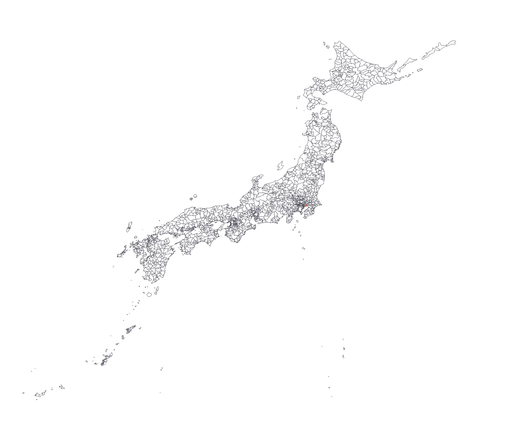

# Japan-map-for-BI

Power BIやTableauで使用できる日本地図(TopoJSON, GeoJSON)

## 提供物一覧（data/ 配下）

<table>
  <thead>
    <tr>
      <th>テーマ</th>
      <th>単位</th>
      <th>id</th>
      <th>説明</th>
      <th>TopoJSON</th>
      <th>GeoJSON</th>
      <th>画像</th>
    </tr>
  </thead>
  <tbody>
    <tr>
      <td>行政区域</td>
      <td>基礎自治体</td>
      <td>地方公共団体コード6桁</td>
      <td>1741市区町村境界</td>
      <td><a href="data/行政区域/municipality/ja_municipality_area.topojson">ja_municipality_area.topojson</a></td>
      <td>WIP</td>
      <td>WIP</td>
    </tr>
    <tr>
      <td>行政区域</td>
      <td>基礎自治体</td>
      <td>地方公共団体コード5桁</td>
      <td>1741市区町村境界</td>
      <td><a href="data/administrative_area/municipality/ja_municipality_area_5.topojson">ja_municipality_area_5.topojson</a></td>
      <td>WIP</td>
      <td></td>
    </tr>
    <tr>
      <td>行政区域</td>
      <td>基礎自治体</td>
      <td>地方公共団体コード6桁</td>
      <td>1741市区町村境界（都道府県界含む）</td>
      <td><a href="data/基礎自治体/municipality/ja_municipality_area_with_pref_boundary.topojson">ja_municipality_area_with_pref_boundary.topojson</a></td>
      <td>WIP</td>
      <td>WIP</td>
    </tr>
    <tr>
      <td>行政区域</td>
      <td>基礎自治体</td>
      <td>地方公共団体コード5桁</td>
      <td>1741市区町村境界（都道府県界含む）</td>
      <td><a href="data/基礎自治体/municipality/ja_municipality_area_with_pref_boundary_5.topojson">ja_municipality_area_with_pref_boundary_5.topojson</a></td>
      <td>WIP</td>
      <td>WIP</td>
    </tr>
    <tr>
      <td>行政区域</td>
      <td>都道府県</td>
      <td>都道府県コード2桁</td>
      <td>47都道府県境界</td>
      <td>WIP</td>
      <td>WIP</td>
      <td>WIP</td>
    </tr>
  </tbody>
  <!-- 横幅を確保するためのダミー行 -->
  <tfoot>
  <tr><th colspan=14>$\hspace{88em}$</th></tr>
  </tfoot>
</table>

## ライセンス

- **ソースコード**
  このリポジトリに含まれるソースコードは [MIT License](./LICENSE) の下で提供されています。

- **データ**
  このリポジトリに含まれるデータは、国土交通省「[国土数値情報ダウンロードサイト](https://nlftp.mlit.go.jp/ksj/)」のデータを加工して作成したものであり、
  「国土数値情報ダウンロードサイトコンテンツ利用規約（政府標準利用規約準拠版）」および
  [Creative Commons Attribution 4.0 International (CC BY 4.0)](https://creativecommons.org/licenses/by/4.0/legalcode.ja) に従って利用可能です。
  出典：国土交通省 国土数値情報ダウンロードサイト（URL）
  加工：K-Oxon
